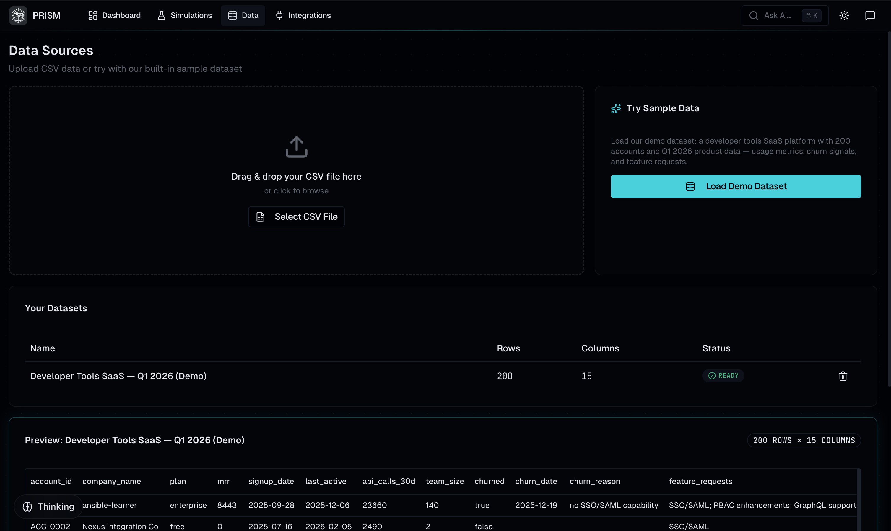
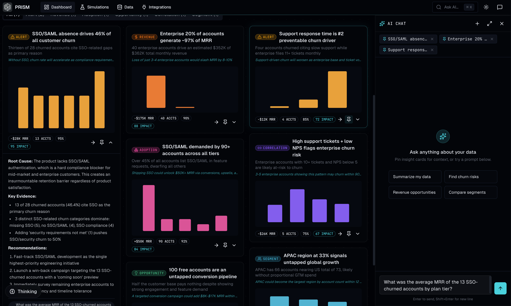
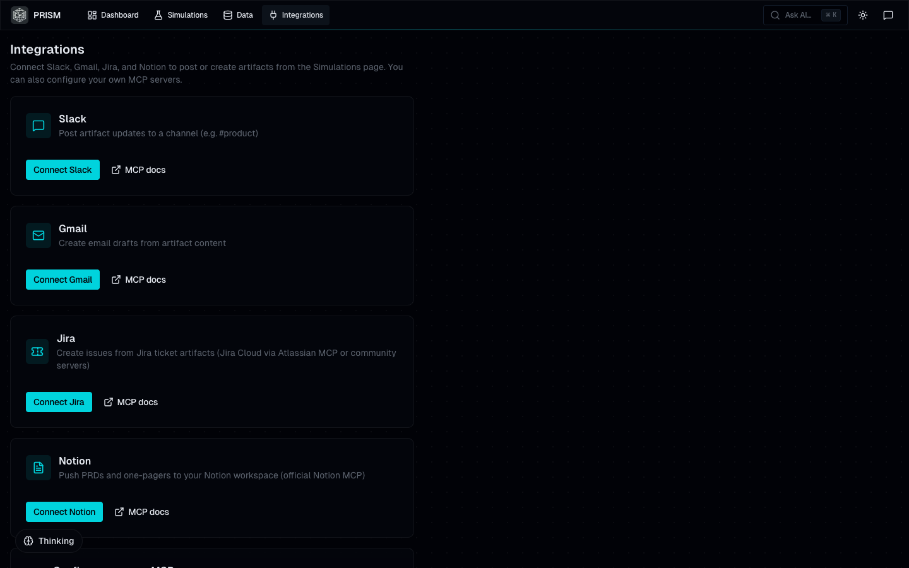

# Prism

**The "Cursor for Product Managers"**

Prism is the first AI-native system for product discovery. While coding agents like Cursor solve *how* to build software, Prism solves the harder problem: deciding *what* to build.

Built for the **Anthropic Claude Code Hackathon** (Feb 2026).

## The Problem

Every successful product requires understanding markets, synthesizing feedback, and prioritizing features. Today, this process is manual, disconnected, and buried in spreadsheets.

Prism changes that. It ingests your customer interviews, usage data, and support tickets to answer "What should we build next?"—not with vague suggestions, but with rigorous, data-backed simulations.

## Key Features

### Automated AI Insights with Claude Opus 4.6

Opus 4.6 acts as your always-on analyst. By ingesting your data, it automatically identifies trends, alerts, and hidden opportunities, presenting them as **AI Insight Cards**.
- **Deep Context**: Expand each card to view the root cause, supporting evidence, and suggested next steps.
- **Interactive Exploration**: Includes suggested questions to ask Opus 4.6 for further analysis.

### Contextual Pinning
Never lose the thread of your analysis. Use the **Pin Feature** to lock the data and reasoning of any insight to the right-side agent.
- **Focused Conversations**: Specify exactly what context Opus 4.6 should keep in mind.
- **Reasoning Retention**: Ensure the AI understands the full history of an insight while you brainstorm solutions.

### Deep Dive 3-Step Process
Move from insight to action with a structured workflow:
1.  **The Problem**: Clearly define the issue based on data.
2.  **Opus 4.6 Reasoning**: Review the AI's logical deduction and evidence.
3.  **Next Steps**: Generate concrete actions that can be added directly to your plan.

### Strategic Action Plan
Your generated next steps don't just disappear. They are organized into a cohesive **Action Plan** viewable at any time in the dashboard.
- **Prioritization**: Tasks are automatically arranged from **Immediate** to **Low Priority**.
- **Management**: Track progress and ensure the most critical items are addressed first.

### Agentic Market Simulations
.png)
Inspired by Wall Street trading algorithms but re-engineered for product management. I've introduced a first-of-its-kind **Market Simulation** engine.
- **Node-Based Interface**: Interact with simulations using a visual, node-based system (similar to n8n).
- **Customizable Rules**: Change parameters and add custom rules. Opus 4.6 uses NLP to understand and apply your specific restrictions.
- **Impact Visualization**: See the ripple effects of your decisions across the entire company before implementation.

### Integrations & Artifact Generation

Get ahead of your work by integrating with popular MCPs like **Slack**, **Notion**, **Jira**, and **Gmail**, or add your own custom integrations.
- **Auto-Drafting**: Generate high-quality artifacts (PRDs, emails, tickets) based on your insights and simulations.
- **Direct Execution**: Based on simulation outcomes, you can instantly review and send Slack messages, emails, or create Jira tickets directly from the platform.

## Tech Stack

- **Frontend**: React 18, TypeScript, Vite, Tailwind CSS, shadcn/ui, Recharts/Nivo
- **Backend**: FastAPI, Python 3.11+, SQLite (WAL mode)
- **AI**: Anthropic Opus 4.6 (Reasoning/Analysis), Sonnet 3.5 (Fast Tasks)
- **Infrastructure**: Docker Compose 

## Getting Started

### Prerequisites

- Node.js 18+
- Python 3.11+
- Anthropic API Key

### 1. Clone the repository

```bash
git clone https://github.com/yourusername/prism.git
cd prism
```

### 2. Backend Setup

```bash
cd backend
python3 -m venv venv
source venv/bin/activate  # On Windows: venv\Scripts\activate
pip install -r requirements.txt

# Create .env file
cp .env.example .env
# Edit .env and add your ANTHROPIC_API_KEY
```

### 3. Frontend Setup

```bash
cd frontend
npm install
```

### 4. Run the App

You can run the full stack with one command if you have Docker:

```bash
docker-compose up --build
```

Or run services individually:

**Backend (Terminal 1):**
```bash
cd backend
source venv/bin/activate
uvicorn app.main:app --reload --port 8000
```

**Frontend (Terminal 2):**
```bash
cd frontend
npm run dev
```

Open [http://localhost:5173](http://localhost:5173) to see the app.

## Documentation

- [Architecture](CLAUDE.md) - Detailed technical breakdown.

## Hackathon Details

This project was built during the Claude Code Hackathon to explore the capabilities of **Opus 4.6**. I leveraged its extended thinking windows for complex market simulation and agentic planning.

---

